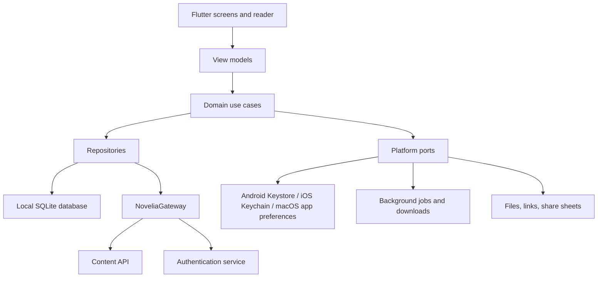

# Novelia Mobile reimplementation plan

Date: 2026-08-10  
Last reconciled: 2026-08-18
Planning status: accepted product baseline; Flutter continuation accepted with
the ADR 0001 physical-device gate explicitly deferred

## Outcome

Build an independently implemented, maintainable Android/iOS reader for
Novelia-compatible content, centered on robust paired Japanese/Chinese reading
and offline use.

The first public-quality release should browse supported novels, open chapters,
render aligned bilingual blocks, restore progress, and download content for
offline reading. It should not reproduce every APK feature before the core
reader is proven.

## Implementation checkpoint — 2026-08-18

Phase 1's semantic reader and the Phase 2 offline vertical slice now exist in
`app/`. The reader renders Chinese first with switchable Japanese underneath,
crosses chapter boundaries through bounded target-and-adjacent windows,
restores stable semantic positions without an animated scroll or synthetic
history write, and fails an unequal translation array as a complete invalid
Translation Revision.

Production composition now starts from cached outlines explicitly marked
offline until a live-origin response refreshes the verified anonymous,
general-rated Novelia catalog. It supports remote search plus source,
publication-state, translation, exact-tag, and sort criteria; continuous page
append with footer retry; a service-ordered default Syosetu ranking; on-demand
details; sectioned chapters; paginated read-only comments; live/cache reader
windows; ongoing whole-novel downloads; and truthful local Library/Settings
projections. The Syosetu ranking now pages through authoritative service pages,
the original-work action opens through thin native Android/iOS/macOS browser
channels, and Offline Downloads expose pause, resume, retry, full-disk failure,
and confirmed removal UI. Phase 3 now has a direct hosted credential exchange,
protected Android/iOS session storage, prompt-free macOS app-local session
persistence, truthful remote folder metadata,
paginated favorite-folder contents, a paginated remote Reading History view,
confirmed Favorite removal with authoritative page reload, and a durable
latest-activity-wins Reading History outbox. Owned-account login, refresh,
prompt-free macOS restoration, folder-list and row-bearing Favorite-page DTOs,
Favorite add, and Reading History write are verified; the UI does not invent
folder counts or expose account rows outside the established general-content
boundary. Favorite mutations fail immediately instead of being queued.
Signed-out transition clears only queued remote history so it cannot leak into
a later account.

SQLite schema v5 stores local reader/application state, device-only search
history, cached outlines/details/ordered TOCs, exact Japanese and Chinese
chapter payloads, download desired state/task progress, and distinct evictable
Cache Copy versus protected Offline Download records. A file-backed integration
test proves online discovery/detail/download, semantic-position save, actual
database close/reopen, network-failure cache recovery, offline reader launch,
and pending-to-complete translation refresh without replacing the stored
task/copy identity. Additional contracts cover atomic interrupted-task restart,
fair bounded translation refresh, stable cache-copy replacement, protected
manifest retention, cache-budget enforcement after dynamic adjacent loads, and
general-to-R18 authorization revocation. Version 5 adds only a credential-free
remote Reading History outbox; tokens and cookies remain outside SQLite.

Reader launch now uses stale-while-revalidate semantics. A cached target is
restored synchronously with any cached immediate neighbors, then revalidated in
the background without changing the visible session. If the target is absent,
only that target blocks launch; uncached neighbors are fetched lazily when the
reader approaches their boundary. This prevents three sequential live timeout
paths from delaying an already-cached Reading Position.

An opt-in anonymous live-network pass has now exercised catalog paging and its
retry path, both pages of the default ranking, hydrated detail and comments,
adjacent and end-of-catalog reader boundaries, a complete seven-chapter Sakura
download, actual SQLite close/reopen, network-failure fallback, and offline
semantic-position restoration. It required no account credentials and did not
check production content into the repository. The pass exposed a service
synchronization race where a ranking translation counter briefly exceeded the
reported original total; ranking results now cap only such positive
over-reports, while negative counts and ordinary catalog/detail inconsistencies
continue to fail closed.

Static analysis is clean and 173 automated tests pass. Release macOS and iOS
Simulator builds pass, and the Android release compiles to a 60.2 MB unsigned
artifact when private signing inputs are absent. The repository verifier rejects
that artifact and the debug-signed APK; release configuration no longer falls
back to Flutter's shared debug certificate. Sanitized account response-shape
diagnostics are debug-only and are absent from the rebuilt 51.1 MB macOS
release. The debug app also installs and
launches to a resumed MainActivity on the configured API 36 emulator without a
launch crash. The prior JNI/Android build issue is resolved. The user explicitly
chose to proceed while deferring physical Android and iOS profiling. Therefore
the Phase 2 software path is implemented and automated, but the Android/iOS
physical-device portion of its exit gate and ADR 0001's physical-reader gate
are not claimed as passed or release-ready.

## Scope

### MVP

- Anonymous catalog/search where supported.
- Decision-focused Web Novel details containing both titles, author,
  publication state, length, last update, tags, synopsis, translation coverage,
  source points or views, source navigation, chapter catalog, and read-only
  Novel Comments.
- Chinese-first reader with Chinese-only and Chinese-then-Japanese modes.
- Translation-source selection; Chinese and Japanese font sizes; Japanese
  opacity and visibility; line spacing; and theme controls.
- Local progress, bookmarks, and explicit chapter/novel downloads.
- Offline launch and reading.
- Authentication, remote favorites and their required folders, and remote
  reading history through the service flow independently verified from the
  reference behavior.
- Discover, Library, and Settings as the only top-level destinations; novel
  details and the reader are entered from them rather than becoming tabs.
- Discover presents Continue Reading, Most Clicked, and Recently Updated before
  search and the full catalog. The catalog supports source, publication-state,
  translation-availability, sort, and exact-tag filters. Rankings is a
  secondary destination inside Discover rather than a top-level tab.
- Catalogs and Rankings use continuous loading with a footer retry and restore
  their filters and list position after navigation. Comment Pages remain
  explicitly paginated.
- Library groups Continue Reading, Favorite Folders, Offline Downloads, and
  Bookmarks, with Reading History as a secondary full view.
- Anonymous browsing and reading, with login requested only when Favorites or
  remote Reading History are used or explicitly from Settings.
- Offline launch into the normal navigation, surfacing Continue Reading and
  Offline Downloads while marking network-backed Discover sections unavailable.
- Simplified Chinese is the only MVP interface locale. Content retains accurate
  Chinese and Japanese language metadata, and UI strings remain
  localization-ready.
- Android and iOS from the first vertical slice.

### Later

- Wenku catalog, volume/file browsing, EPUB downloads, and EPUB rendering.
- Forum, Novel Comment posting/replies, and saved articles.
- TXT/document export through platform share/document flows.
- Ruby/furigana, dictionary lookup, TTS, and tablet layouts.
- Custom API source configuration after the gateway contract is stable.

### Explicitly out of scope

- Website workspace features.
- APK-style self-updating.
- Circumventing access controls, anti-bot systems, paywalls, or rate limits.
- Copying branding, code, UI assets, text, certificates, or novel content from
  the reference APK.
- Website blacklist synchronization.

## Discovery and Novel Details

- Search matches Chinese or Japanese title and author where the service allows.
- Catalog cards expose both titles, source, tags, publication state, chapter
  total, per-source translation coverage, and update recency without implying
  that partial coverage is complete. Use typography-first cards and do not
  fabricate covers or scrape artwork from source-provider sites.
- Novel Details place the chapter catalog before comments. Comments are
  read-only in MVP and display one service-sized Comment Page at a time with
  explicit page navigation. Every reply belonging to the page's top-level
  comments is rendered immediately; there is no expansion state or global
  comment-visibility setting. The screen never grows the whole thread into an
  endless list.
- Provide the original-site link and tappable author and tag searches. Do not
  expose Web Novel EPUB downloads or translation-workspace actions.
- Rankings reuse service-provided source, period, genre, and publication-state
  information behind a secondary Discover route; they do not become a fourth
  top-level destination.
- Preserve service-provided chapter sections and bilingual chapter titles.
  Catalogs default to oldest-first and offer a device-remembered reverse-order
  toggle while remaining virtualized.
- A Translation Source filter means that the source has at least one translated
  chapter. Always display exact translated/total coverage so partial coverage
  cannot appear complete.
- Rankings retain the service's native ordering and defaults, then remember the
  reader's source, period, genre, and publication-state selections locally.
- Retain the last viewed Comment Page only as a dated, expendable Cache Copy;
  never bundle the complete changing comment history into an Offline Download.
- Keep recent catalog queries locally with an explicit clear-history action;
  never synchronize search history through a Reader Account.

## Architecture



Suggested source areas:

- `app`: startup, routing, composition, themes.
- `core/model`: immutable IDs and domain types.
- `core/database`: schema, migrations, DAOs.
- `core/network`: HTTP policy and redacted diagnostics.
- `gateway/novelia`: the only code aware of endpoint paths, cookies, DTOs, or
  undocumented response shapes.
- `features/catalog`, `library`, `reader`, `downloads`, `account`, `comments`,
  and `settings`.
- `platform`: secrets, system browser auth, background work, documents, share,
  links, and connectivity.
- `fixtures`: sanitized API samples and bilingual rendering cases.

Use manual dependency composition initially. Add a dependency-injection
framework only when the graph actually becomes difficult to manage.

## Core reader model

Do not model "one Japanese line / one Chinese line" using rendered screen lines.
Model a semantic aligned block:

```text
AlignedBlock
  stableId
  chapterId
  ordinal
  kind: title | heading | paragraph | dialogue | separator | image
  originalRuns: TextRun[]
  translations: Map<TranslationSource, TextRun[]>
  sourceAnchor
  contentChecksum
```

Rendering rules:

1. Render the selected Chinese translation first and its associated Japanese
   original underneath in Chinese-then-Japanese mode. Chinese-only mode hides
   the original. If the selected translation source is unavailable, show the
   Japanese original alone rather than silently substituting another source.
   Record a source that has not been generated yet as Translation Pending, not
   as permanently absent. Either element may wrap independently.
2. Set the original language to `ja-JP` and the translation to its real Chinese
   locale (`zh-Hans` or `zh-Hant`) so shared Han code points use the intended
   glyph forms.
3. Use a bidirectional, virtualized Continuous Reading Stream with stable block
   IDs that crosses adjacent chapter boundaries; never render an entire chapter
   or novel as one giant text object or WebView.
4. Keep independent original/translation font size, weight, line height,
   opacity, visibility, and pair spacing.
5. Preserve headings, blank blocks, punctuation, emphasis, links, images, and
   future ruby as structured content.
6. Treat unequal block counts, duplicate blocks, or otherwise invalid alignment
   as a failed translation revision. Show the complete Japanese original with a
   refresh/error notice; never guess, shift, or partially repair pairings.
7. Persist position as chapter ID + stable block ID + intra-block offset. Build
   the correct chapter window around that anchor before display, with no
   animated restoration scroll and no history update caused by restoration.
   If an original revision removes the saved block, reopen at the chapter top
   rather than attempting heuristic rebasing. Never persist pixels or rendered
   line numbers.
8. Expose each block to accessibility in the same order it is displayed, with
   clear Chinese and Japanese language metadata.
9. After user scrolling settles, the chapter containing the first substantially
   visible Chinese block is active for Reading History. Loading and position
   restoration never change history by themselves.
10. Treat the latest published chapter, or the last locally available chapter
    while offline, as a normal Availability Boundary with no error or endless
    loading indicator.
11. Accept vertical reader scrolling only; do not map horizontal swipes or edge
    gestures to page or chapter movement. An otherwise unhandled tap in the
    central reading area toggles Reader Chrome. Links, selection gestures, and
    platform gestures take precedence, and toggling chrome never changes
    Reading Position.
12. Reader Chrome provides back, current chapter, catalog, Reading Mode,
    Translation Source, settings, and Bookmark controls. The catalog opens as a
    virtualized, sectioned sheet, marks the active chapter, and jumps a selected
    chapter to its top.
13. Render a chapter boundary with index, Chinese title, smaller Japanese title,
    and publication date when available. Crossing it remains ordinary vertical
    scrolling.
14. When Reading Mode, Translation Source, or typography changes, rebuild around
    the first substantially visible Aligned Block without animation. Never use
    percentage or pixels as the anchor.
15. During initial position restoration, show a neutral skeleton/loading state
    and reveal content only after the anchored window is ready. Do not paint the
    chapter top and then jump or animate to the saved position.
16. Save Reading Position transactionally after a debounce when user scrolling
    settles, immediately on lifecycle/background events, and before ordinary
    reader exit. Never write raw pixel offsets continuously.

The alignment layer should consume API-provided IDs/indices when available. If
the service only returns parallel arrays, normalize them by stable source index
and record mismatch diagnostics. Do not invent semantic alignment from visual
wrapping.

## Offline-first data design

The UI reads from the local database; network calls update it transactionally.
Recommended logical entities:

- `novel`
- `chapter`
- `chapter_revision`
- `aligned_block`
- `translation`
- `reading_progress`
- `bookmark`
- `download_task`
- `novel_download_intent`
- `sync_outbox`
- `sync_metadata`

Download lifecycle:

```text
queued -> fetching -> validating -> stored
   |         |      -> retryable failure
   |         |      -> permanent failure
   +-----> paused
```

Requirements:

- bounded concurrency and user-controlled background behavior; allow Web Novel
  reading and downloads on any connection without cellular prompts;
- store the Japanese Original and the novel's selected Translation Source for
  each Offline Download; a Translation Pending chapter stores its original and
  acquires that translation when it becomes available;
- if another Translation Source is selected offline but not downloaded, retain
  the selection, show the Japanese Original with an offline-unavailable notice,
  and offer that source for download when connectivity returns; never silently
  substitute a different downloaded Chinese Translation;
- atomic chapter revision writes;
- separate original and per-source translation availability so Translation
  Pending can later become translated without discarding the cached original;
- freshness metadata for Cache Copies and Offline Downloads, including the last
  successful check and any server-provided revision, checksum, or ETag;
- revalidate Translation Pending chapters when their novel opens or the app
  returns online or foreground, with a short throttle; manual refresh bypasses
  the throttle and continuous polling is forbidden;
- merge a newly available translation silently when its chapter is not visible;
  when visible, offer a quiet refresh action and rebuild around the preserved
  Reading Position only after the reader accepts;
- recheck once when an online reader reaches the latest Availability Boundary
  and append any newly published chapter; otherwise remain at the boundary and
  rely on manual refresh rather than polling;
- represent a Novel Download as persistent desired state: keep existing
  chapters current and automatically queue every future published chapter;
- reconcile ongoing Novel Downloads when the app foregrounds, their novel
  opens, the reader refreshes manually, and during best-effort OS background
  opportunities; do not promise a strict interval or continuously poll;
- offer new-chapter notifications as an app-level opt-in that defaults off,
  request notification permission only when enabled, and notify only after new
  chapters are validated and stored;
- expose per-novel progress plus pause, resume, cancel, retry, and failed-chapter
  details, reconciling interrupted work when the app next runs;
- checksums/ETags when the server exposes them;
- resumable tasks and foreground reconciliation after iOS/Android termination;
- a user-adjustable Cache Copy size cap with least-recently-read eviction that
  protects current and adjacent chapters, never removes Offline Downloads, and
  never deletes Bookmarks when their cached content is evicted;
- retain Offline Downloads when their Web Novel or chapter disappears from the
  service and mark them unavailable online;
- removing an Offline Download deletes its protected content, deferring only a
  currently open chapter until the reader exits, while preserving novel
  metadata, Reading Position, Bookmarks, Favorites, and Reading History;
- on insufficient storage, pause affected work, preserve every verified
  chapter, report required and available space, and provide retry; never evict
  another Offline Download automatically;
- show separate Cache Copy and Offline Download totals plus per-novel size,
  chapter count, selected Translation Source, and queue state;
- migration tests using real previous database snapshots.

## Networking and authentication

- Put all base URLs, paths, DTOs, cookies, and pagination rules behind
  `NoveliaGateway`.
- Treat the main and auth services as separate origins.
- Use HTTPS and platform trust. Do not copy the HTTP updater.
- Redact tokens, cookies, credentials, chapter content, and user identifiers
  from logs and crash reports.
- Keep bounded diagnostic events locally and export them only on explicit user
  action as a redacted diagnostic bundle. Do not enable automatic analytics or
  hosted telemetry in MVP.
- Retry only safe/idempotent requests; coordinate concurrent `401` refreshes.
- Store Android/iOS tokens only through protected platform storage, not SQLite
  or ordinary preferences. On macOS, use one user-scoped app-preference value
  by explicit product choice so ad-hoc builds never prompt for the login
  Keychain password; document that this desktop value is not encrypted.
- Prefer a system-browser OAuth/OIDC flow with PKCE if Novelia supports it.
- Route login, registration, and password recovery through Novelia's hosted
  authentication when a supported system-browser callback flow exists; keep
  only account status and logout inside the app.
- If only a documented username/password exchange exists, never persist or log
  the password.
- If authentication requires extracting browser cookies or capturing website
  credentials without a sanctioned flow, stop and request a supported API.
- If a response no longer parses safely, preserve all local data, suspend only
  the affected refresh, continue serving verified Cache Copies and Offline
  Downloads, and expose retry plus redacted diagnostics.

Contract tests should use sanitized fixtures. Live smoke tests must be opt-in,
rate-limited, and run only against an owned test account.

## Platform behavior

### Android

- Scoped storage and system document picker; no all-files permission.
- Keystore-backed secrets.
- WorkManager-style persistent background queue.
- Release-signed APK for private direct distribution, potentially through a
  separate private GitHub Release. Do not implement APK self-updating.
- An optional version check may open the private distribution/release page;
  download and installation remain manual.

### iOS

- App sandbox, document picker, and share sheet.
- Keychain-backed secrets and system web authentication.
- Background URL sessions for transfers and OS-scheduled background refresh.
- Do not promise exact background completion times.
- Ad hoc or other permitted direct IPA distribution to the intended small
  audience, with signing material kept outside the public source repository and
  a new production bundle ID.
- An optional version check may open the private distribution/release page;
  download and installation remain manual.

### macOS development target

- Store the combined refresh session in user-scoped app preferences. This is
  an accepted convenience tradeoff for a personal novel reader and avoids
  repeated Keychain authorization when ad-hoc debug signatures change.
- Never persist the password; logout removes the stored session value.

## Delivery phases and gates

### Phase 0: permission and behavior specification

- Record the intended private binary distribution and public-source boundaries,
  including independent branding and exclusion of credentials/content.
- Preserve and hash the reference APK.
- Run it on an arm64 Android device with a dedicated test account.
- Capture navigation, settings, offline behavior, and sanitized request/response
  schemas without bypassing controls.
- Build fixtures for headings, dialogue, blank lines, long paragraphs,
  punctuation, images, missing translations, unequal source lengths, and revised
  chapters.

**Exit gate:** a permitted access/authentication path exists and the reader/API
behavior specification is sufficient to implement without guessing.

Anonymous reader milestones may proceed before authentication is solved, but an
account-complete MVP release remains blocked until a sanctioned authentication
flow is verified. Website-cookie extraction is not an acceptable workaround.

### Phase 1: toolchain and paired-reader spike

- Initialize version control and a fresh application with new development and
  production identifiers.
- Install/lock Flutter, Xcode/iOS, and Android toolchains.
- Implement only the domain reader model, fixture parser, settings, and reader
  screen.
- Implement light, dark, and system themes; independent Chinese and Japanese
  font sizes; line height; Japanese opacity; and reading width. Defer custom
  palettes, underline styling, and the rest of the website theme editor.
- Profile on physical Android and iOS devices.
- Test selection, copy, font scaling, locale glyphs, safe areas, dark mode,
  TalkBack, VoiceOver, relaunch restoration, and one database migration.

**Exit gate:** the criteria in ADR 0001 pass on both platforms. If iOS fails,
evaluate a SwiftUI reader or KMP shared core before building more UI.

### Phase 2: offline vertical slice

- Implement anonymous gateway calls, filtered Web Novel catalog, Discover
  shelves and Rankings, decision-focused Novel Details, paginated read-only
  Novel Comments, chapter list, local database, progress, and explicit
  downloads.
- Make airplane-mode relaunch a routine integration test.
- Add deterministic parsing/alignment fixtures and revision handling.
- If the process ended in the reader, reopen that reader directly at its
  anchored Reading Position; otherwise restore the last top-level destination.

**Exit gate:** a user can discover, download, read, close, relaunch offline, and
resume the same bilingual chapter on Android and iOS.

### Phase 3: account synchronization

- Add the sanctioned authentication flow.
- Add favorites, folders, and remote history.
- Support creating and selecting Favorite Folders; defer folder-management
  polish that the service does not require.
- When adding a Favorite, add immediately if exactly one folder exists. If
  several exist, show a picker with the last-used folder preselected and require
  confirmation.
- Require connectivity for favorite changes and fail them immediately while
  offline rather than maintaining an account-mutation outbox.
- Queue Reading History updates in an outbox; the most recent reading activity
  wins history conflicts, even when it represents rereading an earlier chapter.
- Verify expiry, refresh, logout, credential deletion, and multi-device changes.
- On logout, remove credentials and remote account state while retaining local
  progress, bookmarks, Cache Copies, and Offline Downloads unless the reader
  explicitly removes downloaded data.

**Exit gate:** account state survives normal failures without credential leaks,
duplicate mutations, or lost local reading state.

### Phase 4: breadth and release hardening

- Forum, Novel Comment posting/replies, saved articles, and document export.
- Background scheduling, interrupted-download recovery, and cache controls.
- Accessibility/privacy review, migration matrix, crash-log redaction, and
  private-release notes and installation instructions.
- Test release-signed APK and IPA artifacts through the intended private
  distribution path.

**Exit gate:** distribution permissions are documented and both private builds
pass privacy, accessibility, offline, migration, and failure-mode checks.

### Phase 5: customization

- Wenku browsing, EPUB downloads, and EPUB rendering.
- Ruby/furigana and dictionary lookup.
- TTS and annotations.
- Tablet/iPad side-by-side or focus layouts.
- Additional translation sources through a versioned adapter contract.

## Verification matrix

Every release candidate should cover:

- anonymous, authenticated, expired-session, and offline states;
- short, very long, and malformed chapters;
- all supported translation sources and a missing source;
- unequal Japanese/Chinese block counts;
- Japanese punctuation, CJK shared glyphs, emoji, Latin text, and links;
- small/large accessibility fonts, light/dark themes, portrait/landscape, phone
  and tablet widths;
- interrupted download, full disk, corrupt cache, schema migration, server 401,
  404, 429, and 5xx responses;
- position restoration after app kill and chapter revision, without a visible
  jump, animated scroll, or synthetic history update;
- fallback to the chapter top when a revision removes the saved Aligned Block;
- a chapter first cached or downloaded while Translation Pending and later
  refreshed after its selected Chinese Translation becomes available;
- no layout jump when a visible Translation Pending chapter is refreshed, and
  automatic acquisition of a future chapter while its Novel Download remains
  enabled;
- download pause/resume/cancel/retry across process termination, offline source
  switching without Chinese-source substitution, and removal without loss of
  Reading Position or Bookmarks;
- ongoing Novel Download reconciliation after foreground/background
  opportunities, notification opt-in, and full-disk pause/retry without
  eviction of verified content;
- debounced Reading Position persistence during scrolling and immediate
  persistence on background/exit;
- safe schema-drift behavior that preserves local data and suspends only the
  affected refresh;
- Cache Copy eviction without Bookmark loss, and continued access to an Offline
  Download after its source content disappears from the service;
- VoiceOver/TalkBack order and text selection/copy.

Prefer behavioral invariants over pixel-identical screenshots because Android
and iOS system fonts and rasterizers differ.

## Risk register

| Risk | Severity | Containment |
| --- | --- | --- |
| No supported authentication/API path | Critical for account release | Continue the anonymous spike, keep service details behind the gateway, and never extract browser cookies |
| Undocumented API churn | High | One gateway, DTO/domain separation, fixtures, contract tests |
| Unstable paragraph alignment | High | Semantic block model, mismatch fixtures, no visual-line alignment |
| iOS typography/selection/accessibility failure | High | Phase-1 physical-device gate and native-reader fallback |
| Background jobs suspended by OS | Medium | Resumable queue and foreground reconciliation |
| Unbounded growth from ongoing Novel Downloads | Medium | Visible per-novel/storage usage, pause/remove controls, and full-disk handling |
| Token or content leakage | High | Protected mobile stores, user-scoped macOS preferences by explicit tradeoff, redacted logs, no secrets in SQLite |
| Cache/migration data loss | High | Transactional writes and snapshot migration tests |
| Solo-project overarchitecture | Medium | Vertical slices, manual composition, defer non-core features |

## Immediate next actions

1. Provide the external private Android keystore and Apple Team/profile inputs,
   then build and verify distributable APK/IPA artifacts. The repository now
   contains only secret-free configuration and rejects unsigned/debug-signed
   Android artifacts; no in-app updater or public-store workflow is planned.
2. Expand ranking selection beyond the current paginated default Syosetu query
   only if the additional provider-specific combinations materially help novel
   discovery.
3. Optionally persist only the last viewed Comment Page as an expendable dated
   Cache Copy; current comments intentionally have no offline fallback.
4. Complete the remaining Phase 3 credentialed mutation smoke through the
   running app: a reversible favorite add/remove, a Reading History write, and
   explicit logout invalidation. Do not place credentials in source, shell
   arguments, logs, screenshots, or chat; do not extract browser cookies.
5. Repeat the bounded live/offline smoke pass before cutting a private release
   candidate; keep it opt-in, low-volume, and outside routine CI.

## Primary references

- [Flutter architecture guide](https://docs.flutter.dev/app-architecture/guide)
- [Flutter supported platforms](https://docs.flutter.dev/reference/supported-platforms)
- [Flutter `Text.locale`](https://api.flutter.dev/flutter/widgets/Text/locale.html)
- [Android offline-first data guidance](https://developer.android.com/topic/architecture/data-layer/offline-first)
- [Android WorkManager](https://developer.android.com/reference/androidx/work/WorkManager.html)
- [Apple background downloads](https://developer.apple.com/documentation/foundation/downloading-files-in-the-background)
- [Apple Keychain services](https://developer.apple.com/documentation/security/keychain-services)
- [Android Keystore](https://developer.android.com/privacy-and-security/keystore)
- [OAuth 2.0 for native apps (RFC 8252)](https://www.rfc-editor.org/rfc/rfc8252)
